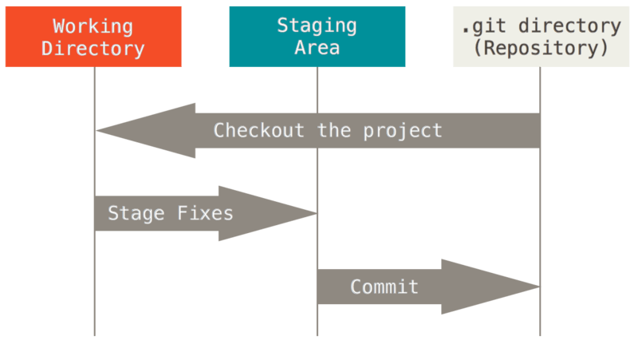

## Git Quick Reference

### Prerequisites
Git - https://git-scm.com/downloads

### Getting Started

Once you have created your GitHub account and accepted the assignment, you need
to clone your repository. Cloning just means you are copying the repository
from GitHub to the computer you want to work on.

So, if your repository is here:

https://github.com/PurchaseCollege/socket-programming-waltermeyer

On your computer, from the command line, do:

```
git clone https://github.com/PurchaseCollege/socket-programming-waltermeyer.git
cd socket-programming-waltermeyer
```

Now you are in your project folder.

### Git Basics

Git allows you to track changes in your code as you work. It also allows you to
go back in time to a previous version of your code, or simply see what has
changed over the course of developemnt.

Git uses a three tier model.

Files are in one of three states:

Commited (in the repository)

Staged (waiting to be committed to the repository)

Working (changed, but not staged yet)



### Git Commands

**Check Changes:**

```git status``` - see what files have been modified or are untracked

```git log``` - see the log of what has been committed

```git ls-files``` - see what files are in the git repository

**Stage and Commit Changes:**

```git add filename``` - add a file to the staging area

```git commit -m "I changed some things!"``` - commit all changed files in the staging area to your repository.

**Rollback Changes:**

```git checkout -- filename``` - revert unstaged changes back to the last commit

```git reset HEAD filename``` - remove a file from the staging area

Git uses a 3 tier model. That is, when you are working you essentially save and
commit your changes to your repository.

### Git Workflow Example

Go to my project directory:
```
cd socket-programming-waltermeyer
```

Do some work:
*... make some edits to a file, e.g. ```simple_server.py```...*
*... test that the code works ...*

Add the file to the staging area:
```
git add simple_server.py
```

Commit the file:
```
git commit -m "fixed a bug in simple_server.py"
```

Now, at this point you are done, but you need to ```git push``` so that the
repository you have locally gets sent to your GitHub!

Push to GitHub
```
git push -u origin master
```
